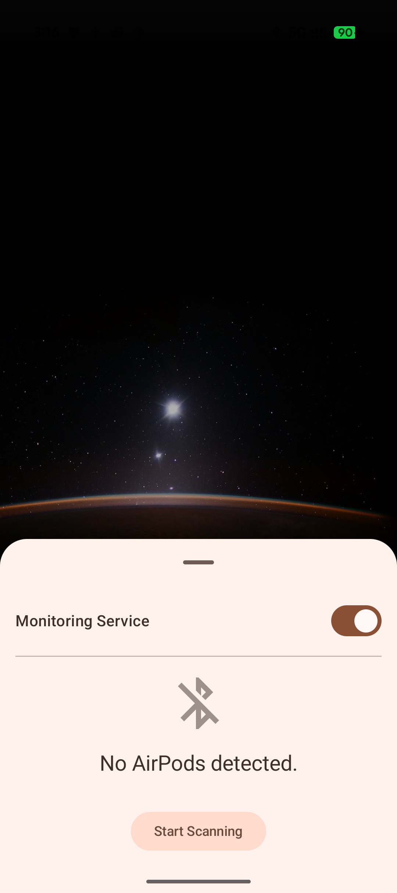
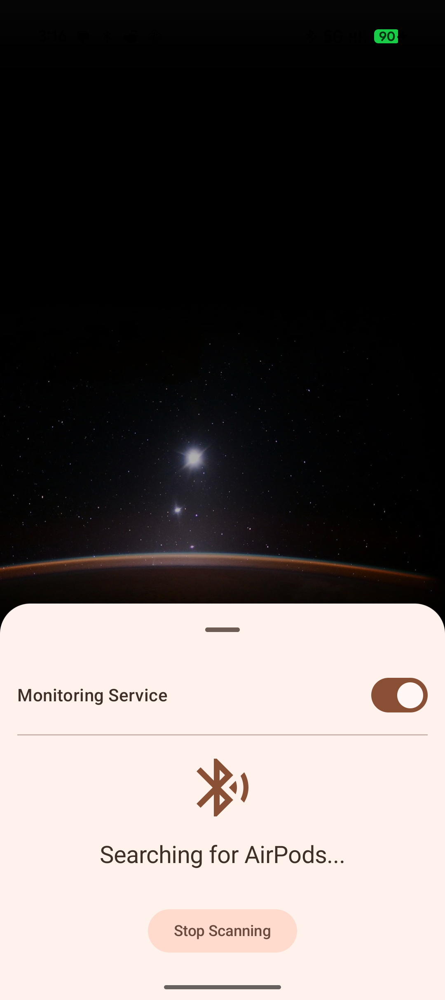
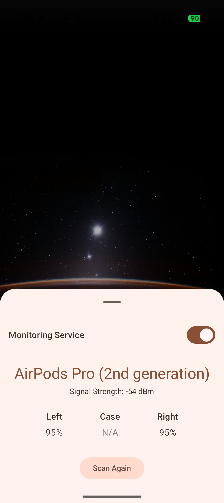

# AirPods Battery Status for Android

A simple and lightweight Android application that displays the current battery status of your connected Apple AirPods and their charging case.  

The app provides a convenient pop-up dialog that automatically appears when your AirPods connect to your Android device, giving you instant access to battery percentages.

## Features
- 📱 Lightweight and easy to use  
- 🎧 Shows battery percentage for AirPods (left, right, and case)  
- ⚡ Automatic pop-up when AirPods connect  
- 🟢 Runs seamlessly in the background  

## Screenshots

  
  
  

